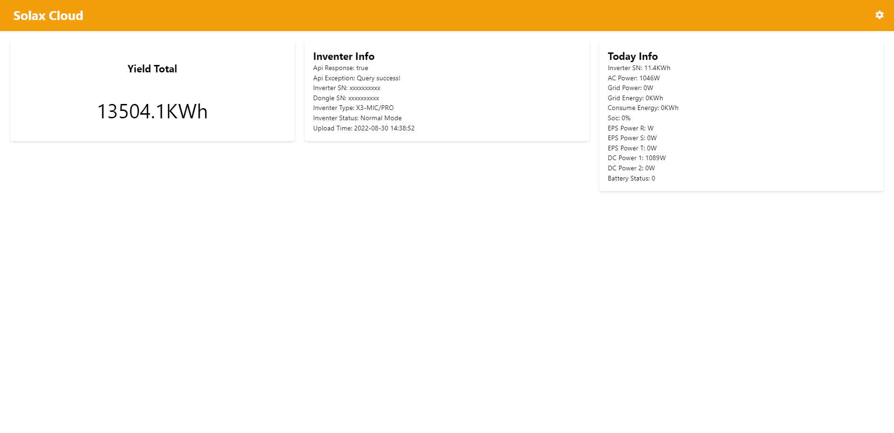

# Solax Cloud ui
Simple project for solax data through API

Remember to Add TOKEN and SN to `./src/data.json`

## Getting token and sn
### Your device NEEDS to be connected to WI-FI
### Token
1. Open https://www.solaxcloud.com/#/login and login
2. Go to Service and API https://www.solaxcloud.com/#/api
3. Copy `ObtaintokenID `

### SN from dongle is located on wifi dongle plugged into inventer or you can copy it from website
1. Open https://www.solaxcloud.com/#/inverter
2. Copy `Registration No.`